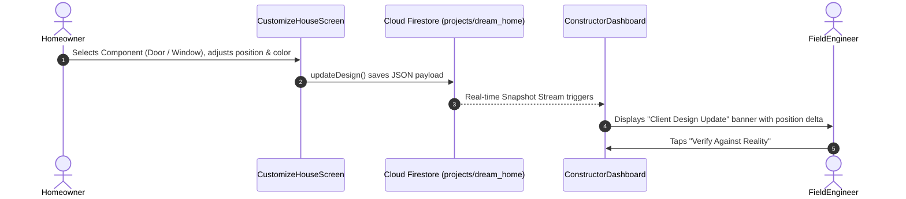

# 🏠 House Vision v2

> **Next-Generation 3D & Augmented Reality Construction Coordination Architecture**
> *Visualize • Build • Monitor*

---


## 📌 Overview

**House Vision v2** is an enterprise-grade Flutter application built for real-time BIM coordination, on-site Computer Vision verification, and Augmented Reality between **Homeowners** and **Field Constructors**.

### 🌟 Key Prototype Features
1. **Architectural Dark Studio Design System**: High-contrast, field-ready dark aesthetic (`#0B0F19` deep carbon, `#06B6D4` electric cyan, `#F59E0B` safety amber, `#10B981` laser emerald) with HUD telemetry headers (live GPS, compass micro-drift, and LiDAR lock status).
2. **On-Device Computer Vision & ML Inspection (`BimVisionAiEngine`)**:
   - Pure Dart edge-detection and 4x4 spatial luminance gradient matrix analysis.
   - Dynamic bounding box projection with confidence scores and tolerance delta metrics.
   - 4 pre-configured site telemetry inspection presets (Window rough framing, Shear wall plumb tilt, Foundation microcracks, Rebar cage pitch).
   - Interactive **BIM vs Reality Split-Curtain swipe slider** with draggable knob and real-time laser scan animation.
   - Camera photo capture & Gallery image import with instant anomaly detection.
   - Instant Verification Audit Certificate export modal.
3. **AR Site Projector with Spatial Gizmos**:
   - 3D spatial perspective ground grid with dynamic shadow footprint.
   - Interactive scale selector chips (1:100 Tabletop, 1:50 Model, 1:20 Site, 1:1 True-Scale).
   - 360° rotation dial and Heliodon Sun & Shadow study simulation (07:00 to 18:00).
   - **Working Virtual Laser Tape Measure**: Interactive touch-capture overlay that registers Point A and Point B, computes 3D Euclidean distance vector, and renders safety amber glowing laser crosshairs, line, and live metric dimension tag (`3.63 m (11.9 ft)`).
4. **Interactive 3D BIM Studio & Customizer**:
   - Real-time 3D model manipulation with architectural layer toggles (Structure, MEP, Envelope).
   - Parametric finish material selectors (Walnut, Modern White, Concrete, Bronze, Matte Black).
   - Real-time dynamic cost estimation engine (`$296,350 +4.0% VAR`).
5. **Persistent Navigation Shell & Dual Workflows**:
   - 4-tab bottom navigation dock (`Dashboard`, `3D Studio`, `AI Vision`, `AR Projector`).
   - Seamless role switching between **Homeowner** and **Constructor** workflows.
   - Bi-directional Cloud Firestore synchronization with resilient offline fallback.

---

## 📂 Project Architecture

```
application/v2/
├── .gitattributes              # Git LFS rules for 3D binary assets (.glb)
├── .gitignore                  # Comprehensive Flutter, Android, iOS & IDE exclusion rules
├── analysis_options.yaml       # Dart analysis & lint rules
├── pubspec.yaml                # Project metadata & modern dependencies
│
├── assets/
│   └── models/
│       ├── house.glb           # Primary 3D architectural model
│       ├── house_ar.glb        # Optimized lightweight model for AR plane anchoring
│       └── house.png           # Architectural preview render
│
├── lib/
│   ├── main.dart               # Bootstrap, MultiProvider DI & fault-tolerant Firebase boot
│   ├── firebase_options.dart   # Cross-platform Firebase project configuration
│   │
│   ├── core/                   # Shared foundational utilities & design system
│   │   ├── constants/          # AppColors (Dark Studio palette), AppStrings, dimensions
│   │   ├── theme/              # Material 3 Dark Studio theme, glassmorphism, input & slider styles
│   │   └── widgets/            # HudTelemetryBar, CustomCard, StatusBadge
│   │
│   ├── domain/                 # Pure business entities & abstract contracts
│   │   ├── models/             # ProjectModel, DesignComponent, MlInspectionModel, UserRole
│   │   └── repositories/       # ProjectRepository, AuthRepository contracts
│   │
│   ├── data/                   # Data sources & concrete repository implementations
│   │   ├── services/           # BimVisionAiEngine (ML & CV), FirebaseService (Firestore/Auth)
│   │   └── repositories/       # ProjectRepositoryImpl, AuthRepositoryImpl
│   │
│   └── presentation/           # Feature UI modules with MVVM pattern
│       ├── main_navigation_shell.dart  # Persistent 4-tab bottom navigation dock
│       ├── auth/               # LoginScreen, RoleSelectionScreen (Dark Studio)
│       ├── homeowner/          # HomeownerDashboardScreen, HomeownerViewModel
│       ├── constructor/        # ConstructorDashboardScreen, ConstructorViewModel
│       ├── customization/      # CustomizeHouseScreen (3D BIM Studio & Real-time Costing)
│       ├── ar_viewer/          # ARHouseScreen (AR Projector & Virtual Laser Tape Measure)
│       └── verification/       # RealityVerificationScreen (AI Vision Lab & Split-Curtain)
│
└── test/
    ├── unit/                   # ML vision engine, models serialization & domain tests
    └── widget/                 # App smoke and widget tests
```

---

## 🚀 Step-by-Step Git Upload Guide

You can initialize and upload this directory to your Git repository effortlessly.

### 1. Initialize Git in `application/v2` (or root)
Open terminal in `application/v2`:
```bash
git init
```

### 2. Large File Handling (Git LFS)
The `assets/models/house.glb` file is ~95MB. GitHub warns on files > 50MB and rejects files > 100MB.
To ensure smooth pushes, use **Git LFS**:

```bash
# Install Git LFS (one-time setup on machine)
git lfs install

# Verify .gitattributes is tracking .glb (already pre-configured in v2)
git lfs track "*.glb"
git add .gitattributes
```

*(Note: If you do not wish to track the large 95MB model on GitHub, you can add `assets/models/house.glb` to `.gitignore` and keep `house_ar.glb` which is only 4.9MB).*

### 3. Stage, Commit & Push
```bash
# Stage all files (the .gitignore ensures build artifacts are excluded)
git add .

# Commit
git commit -m "feat: complete House Vision v2 clean architecture"

# Connect remote and push
git branch -M main
git remote add origin <YOUR_GITHUB_REPOSITORY_URL>
git push -u origin main
```

---

## 💻 Running the Application

### 1. Install Dependencies
```bash
flutter pub get
```

### 2. Run Static Analysis & Tests
```bash
flutter analyze
flutter test
```

### 3. Run on Target Device
- **Android Device / Emulator**:
  ```bash
  flutter run -d android
  ```
- **Chrome / Web**:
  ```bash
  flutter run -d chrome
  ```
- **Windows Desktop**:
  ```bash
  flutter run -d windows
  ```

---

## 🔄 How Bi-Directional Synchronization Works



1. **Homeowner** adjusts the slider in `CustomizeHouseScreen`.
2. `CustomizeViewModel` calls `ProjectRepository.updateDesign(...)`.
3. The data payload is written to `projects/dream_home` on Cloud Firestore and broadcasted locally.
4. `ConstructorViewModel` receives the real-time event instantly via `projectRepository.streamLatestDesign(...)`.
5. The **Constructor Dashboard** highlights the modified element and prompts field inspection before structural work begins.
